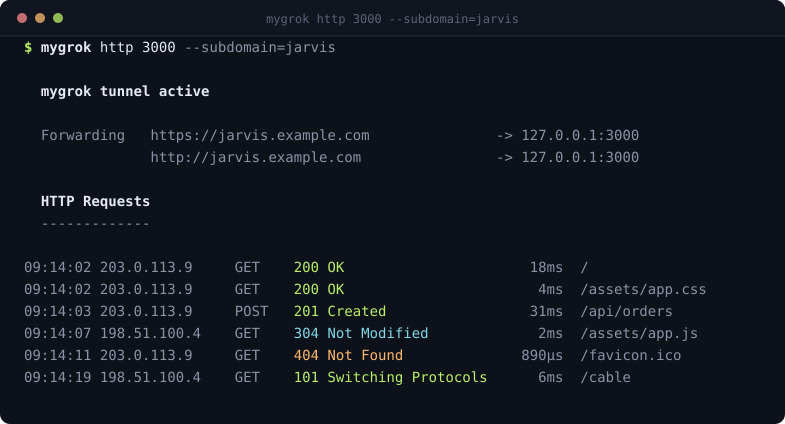
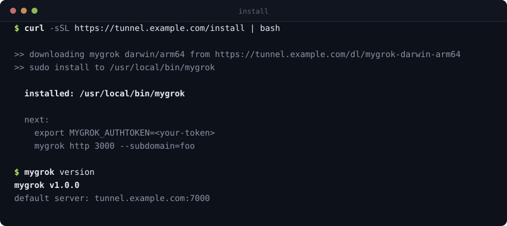
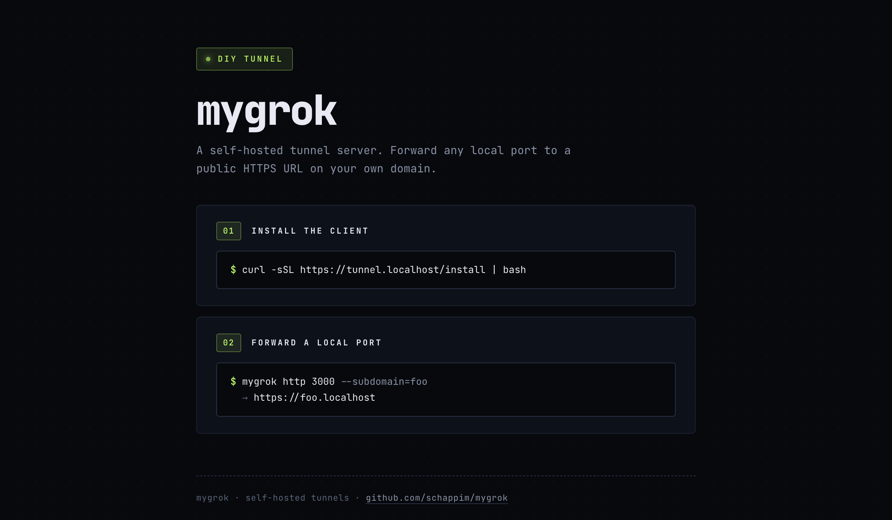
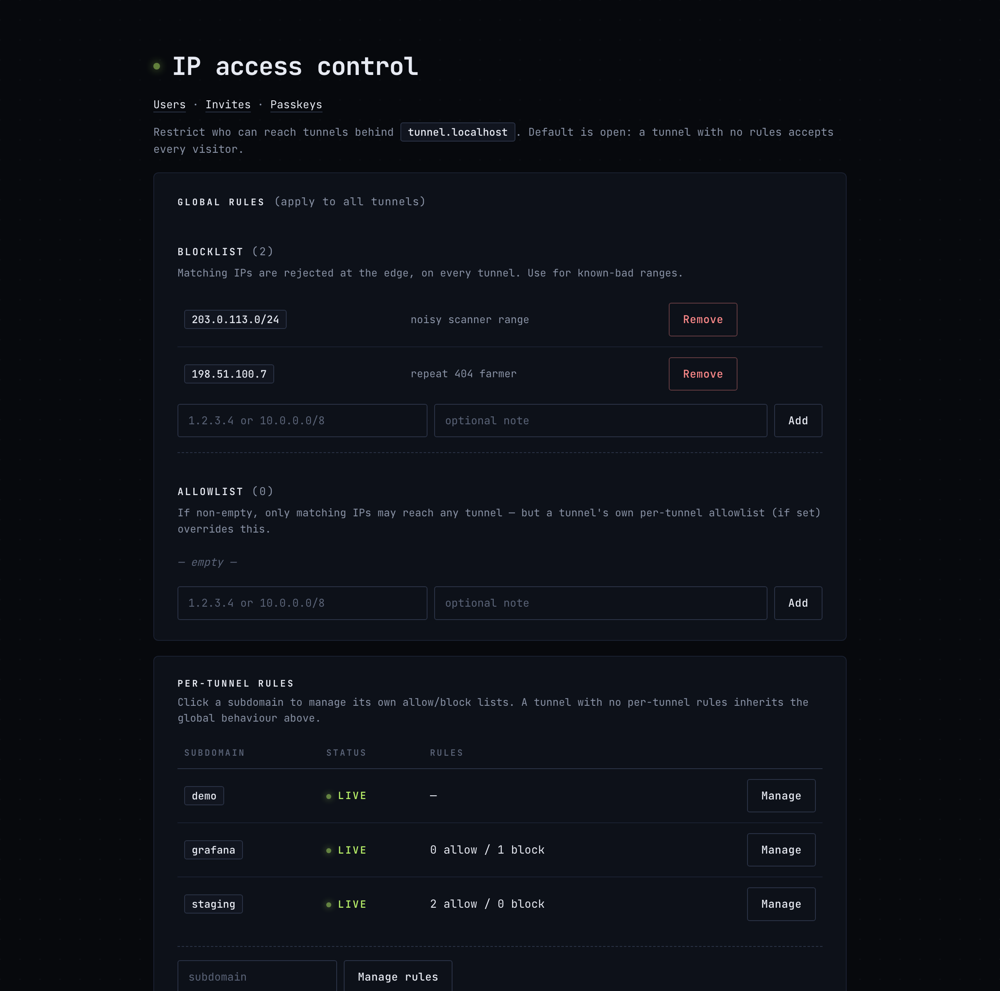
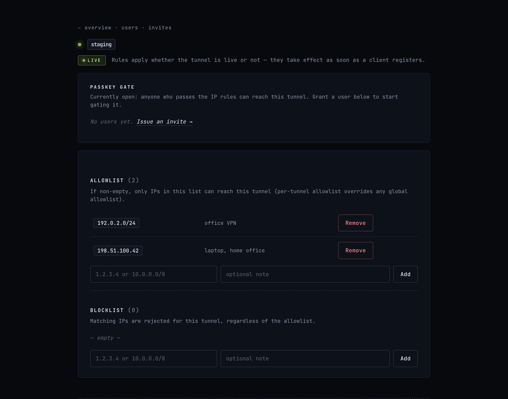
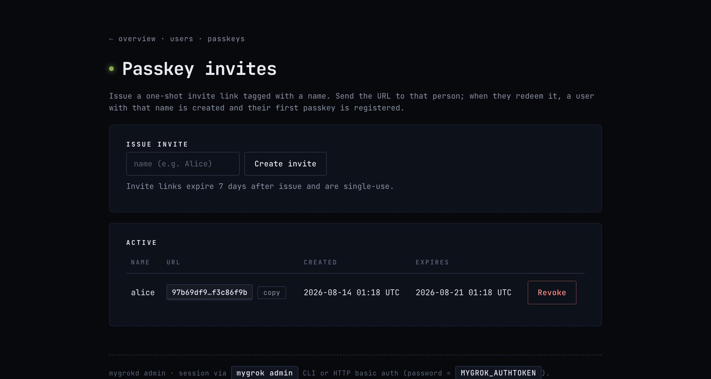
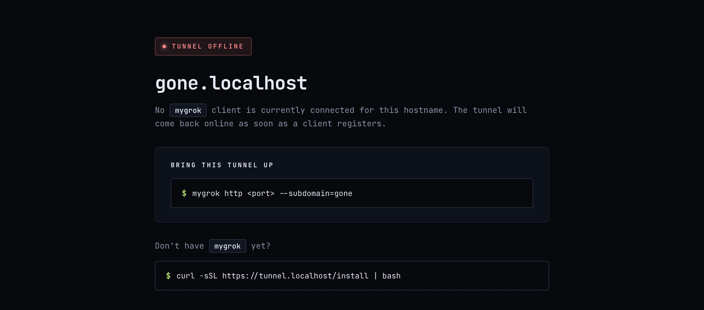

<h1 align="center">mygrok</h1>

<p align="center">
  <strong>Your own ngrok.</strong> Forward a local port to a public HTTPS URL on a domain you own —
  on a server you own, for the price of the smallest VPS your provider sells.
</p>

<p align="center">
  <a href="https://github.com/schappim/mygrok/actions/workflows/ci.yml"></a>
  <a href="LICENSE"></a>
  
  
</p>

<p align="center">
  
</p>

Two Go binaries, no daemon zoo, no account, no session limits, no "your
tunnel expired" page. `mygrokd` runs on a box with wildcard DNS pointed at
it; `mygrok` runs wherever you want to expose something.

```bash
mygrok http 3000 --subdomain=jarvis     # → https://jarvis.your-domain.com
mygrok serve gallery ./photos           # static folder, public URL, one command
mygrok mcp 8790 --subdomain=tools       # local MCP server → claude.ai connector
```

---

## Contents

- [Why](#why) · [Install](#install) · [60 seconds to a public URL](#60-seconds-to-a-public-url)
- [What it looks like](#what-it-looks-like) — the web UI
- [Locking things down](#locking-things-down) — basic auth, IP rules, passkeys
- [Feature tour](#feature-tour) · [CLI at a glance](#cli-at-a-glance)
- **Docs:** [CLI reference](docs/cli.md) · [Config file](docs/config.md) ·
  [Access control](docs/access-control.md) · [Run your own server](docs/server.md) ·
  [MCP connectors](docs/mcp.md) · [Architecture & protocol](docs/architecture.md)
- [Limitations](#limitations) · [Contributing](CONTRIBUTING.md) · [Security](SECURITY.md)

---

## Why

Tunnel services are great until you're paying monthly for a random subdomain
that changes every restart, or your webhook testing hits a session limit
mid-debug, or you'd rather not route your unreleased product through someone
else's infrastructure.

mygrok is the boring alternative: **you own every piece.** The server, the
domain, the certificate, the auth token, the binary. Nothing phones home.
There's no account to create and no free tier to age out of. The whole thing
is about 9,500 lines of Go with eight dependencies.

What you get that a plain SSH reverse tunnel doesn't give you:

- **Stable, memorable URLs.** `jarvis.your-domain.com`, every time.
- **Real TLS**, issued and renewed automatically. No self-signed warnings.
- **Survives reboots** — one command installs a launchd agent or systemd unit.
- **Access control that isn't just a password** — IP rules and WebAuthn
  passkeys, both managed from a web UI or the CLI.
- **Heals from network blips in under a second** instead of sitting in
  backoff waiting for a dead session to time out.

---

## Install

### The client

**Homebrew** (macOS and Linux):

```bash
brew install schappim/mygrok/mygrok
```

**From your own server** — this is the nice one. Binaries served by your
`mygrokd` are stamped with its address at build time, so they arrive already
knowing where to connect:

<p align="center">
  
</p>

```bash
curl -sSL https://tunnel.your-domain.com/install | bash
```

Set `MYGROK_INSTALL_DIR=$HOME/bin` if you'd rather not use sudo.

**With Go:**

```bash
go install github.com/schappim/mygrok/cmd/mygrok@latest
```

Homebrew and `go install` builds are deliberately generic — they carry no
default server, so point them at yours with `MYGROK_SERVER` or
`~/.mygrok/config.toml`. See [Config file](docs/config.md).

### The server

One command on a fresh Debian/Ubuntu box — DigitalOcean, Hetzner, EC2, Vultr,
a Pi under your desk:

```bash
curl -sSL https://raw.githubusercontent.com/schappim/mygrok/main/deploy/install-server.sh \
  | sudo bash -s -- --domain example.com --email you@example.com
```

It creates a service user, installs the binary, generates an auth token,
writes a hardened systemd unit, opens the firewall, and prints the two DNS
records to add. Full walkthrough for each cloud, plus DNS and certificate
options, in **[docs/server.md](docs/server.md)**.

---

## 60 seconds to a public URL

```bash
export MYGROK_AUTHTOKEN="<the token your server printed>"

mygrok http 3000 --subdomain=jarvis
```

```
  mygrok tunnel active

  Forwarding   https://jarvis.example.com               -> 127.0.0.1:3000
               http://jarvis.example.com                -> 127.0.0.1:3000

  HTTP Requests
  -------------

09:14:02 203.0.113.9     GET    200 OK                      18ms  /
09:14:03 203.0.113.9     POST   201 Created                 31ms  /api/orders
```

Make it permanent:

```bash
mygrok service install 3000 --subdomain=jarvis
```

That's a launchd agent on macOS, a systemd unit on Linux. Starts at
login/boot, restarts on crash, and — on Linux — keeps your auth token in a
root-only environment file rather than in the world-readable unit.

Don't have a server running but do have a folder?

```bash
mygrok serve                    # cwd at a random subdomain
mygrok serve gallery ./photos   # ./photos at gallery.example.com
mygrok serve ./photos           # no tunnel, just http://127.0.0.1:8080
```

---

## What it looks like

Every server has a management host at `tunnel.<your-domain>` — the landing
page, the installer, the client downloads, and the admin UI. No separate
dashboard to deploy, no extra port.

<p align="center">
  
</p>

### Access control

Every tunnel, live or merely configured, with its rules at a glance. Rules
apply the moment a client registers, so you can lock a subdomain down before
anyone has ever tunnelled it.

<p align="center">
  
</p>

Per-tunnel allow and block lists, single IPs or CIDR, each with a note so you
remember why in six months:

<p align="center">
  
</p>

### Passkey invites

Issue a one-shot link, send it to a person, they register a passkey with
Touch ID or their phone. Then grant them the specific tunnels they should
reach. No shared password, no accounts to create, revocable per device.

<p align="center">
  
</p>

### When nobody's home

Hit a subdomain with no client connected and you get this, rather than a
browser error page — with the exact command to bring it back up.

<p align="center">
  
</p>

---

## Locking things down

A tunnel is public by default — anyone with the URL reaches your app. Three
mechanisms change that, and they stack.

**A shared password**, enforced by the client before your app sees anything:

```bash
mygrok http 3000 --subdomain=jarvis --basic-auth=alice:s3cret
```

**IP rules**, enforced at the server edge before the request even crosses the
tunnel:

```bash
mygrok admin allow jarvis 203.0.113.7 --note=office
mygrok admin block global 198.51.100.0/24 --note=scanner
mygrok admin rules --json | jq '.tunnels_configured'
```

**Passkeys**, for actual per-person access:

```bash
mygrok admin invite alice        # → send her the printed URL
mygrok admin grant jarvis alice  # she can now reach jarvis, nothing else
mygrok admin revoke jarvis alice
```

Locked tunnels bounce unauthenticated visitors to a WebAuthn login and issue
a 24-hour session cookie scoped to your whole zone. Users add extra devices
themselves at `/account` without bothering you.

Full semantics — evaluation order, storage format, the safety net that stops
you locking yourself out — in **[docs/access-control.md](docs/access-control.md)**.

---

## Feature tour

| | |
|---|---|
| **Public URLs** | `https://<subdomain>.<your-domain>`, stable across restarts |
| **TLS** | Let's Encrypt, automatic. A wildcard via DNS-01 if you configure a provider, otherwise per-hostname on demand — no cloud credentials needed either way |
| **DNS providers** | Route 53, Cloudflare, DigitalOcean, or none |
| **Persistence** | `mygrok service install` → launchd agent or systemd unit |
| **Static folders** | `mygrok serve [subdomain] [dir]` — `python -m http.server` plus a public URL |
| **MCP connectors** | `mygrok mcp <port>` exposes a local MCP server to claude.ai, gated by an unguessable capability URL. [More →](docs/mcp.md) |
| **Custom hostnames** | `--hostname=app.example.com` — CNAME your own domain at a tunnel, certificate issued on demand |
| **Basic auth** | `--basic-auth=user:pass`, constant-time, credentials never leave your machine |
| **IP allow/block** | Per-tunnel and global, CIDR supported, web UI + JSON API |
| **Passkeys** | Multi-user WebAuthn with per-tunnel grants and self-serve device enrolment |
| **LAN-direct** | Same-NAT visitors get redirected straight to your machine instead of round-tripping through the server. Real certificate, no warnings. [How →](docs/architecture.md#lan-direct) |
| **Self-update** | `mygrok update` pulls the matching build from your server |
| **Real client IPs** | Inbound `X-Forwarded-For`/`X-Real-IP` are stripped and replaced with the true source, so your app's IP logic works |
| **WebSockets** | Upgrades pass through — after the 101 it's raw bytes both ways |
| **Fast reconnect** | A per-process client ID lets a client pre-empt its own stale session; blips heal in under a second |
| **Offline page** | A styled "tunnel offline" page instead of a connection error |
| **Claude skill** | [`skills/mygrok/`](skills/mygrok/) teaches Claude Code to drive all of this |

---

## CLI at a glance

```
mygrok http  <port> [--subdomain=<name>] [--hostname=<host>] [--basic-auth=<u>:<p>] [--lan=auto]
mygrok mcp   <port> [--subdomain=<name>] [--secret=<token>] [--no-strip] [--path=/mcp]
mygrok serve [<subdomain>] [<dir>] [--port=<n>] [--index=<file>]
mygrok service install <port> --subdomain=<name> [--name=<svc>] [--mcp]
mygrok service uninstall|list|status|logs [<name>]
mygrok admin [login|tunnels|rules|allow|block|invite|grant|revoke|users|passkeys]
mygrok update
mygrok version
```

Shared by every command that talks to a server: `--server=<host:port>`,
`--auth=<token>` (not `update`, which only fetches a public binary), and
`--config=<path>`. Precedence is **CLI flag → environment
→ config file → built-in default**, so a `.mygrok.toml` in your project can
supply the port and subdomain and you just run `mygrok`.

`mygrok admin help` prints a complete machine-readable reference — every
subcommand, flag, JSON schema, and exit code. It's written to be pasted into
an LLM prompt.

Full reference with every flag: **[docs/cli.md](docs/cli.md)**.

---

## Limitations

Stated plainly, because finding out later is worse:

- **HTTP/1.1 only.** WebSockets work (they're still HTTP/1.1). HTTP/2 and
  gRPC do not.
- **No raw TCP tunnels.** Routing is by `Host` header, so there's no
  equivalent of `ngrok tcp 22`.
- **One shared auth token.** Everyone holding it can register tunnels.
  Per-client identity and revocation don't exist; passkeys gate *visitors*,
  not tunnel operators.
- **Single node.** No HA. If the box goes down, tunnels drop until it's back.
- **The control plane is unencrypted.** The client↔server connection on
  `:7000` is plain TCP: the shared token and all tunnelled traffic are
  visible to anyone on the path. Encrypting it is the top roadmap item. See
  [SECURITY.md](SECURITY.md).
- **No traffic inspector.** No local request-replay UI like ngrok's `:4040`.
- **First-come subdomains.** A name belongs to whoever claims it, until they
  disconnect. No permanent reservations.
- **Custom hostnames don't combine with the passkey gate or LAN-direct** —
  both depend on cookies and certificates scoped to your wildcard zone, and a
  CNAME is a different origin.

More detail, plus the security posture behind each, in [SECURITY.md](SECURITY.md).

---

## Building from source

```bash
git clone https://github.com/schappim/mygrok.git
cd mygrok
go build ./...
go test ./...
```

`./build.sh` does the full cycle — cross-compiles all four client variants,
embeds them in the server so `/install` and `/dl` work, builds the server,
installs the client locally, and ships it over SSH:

```bash
MYGROK_HOST=tunnel.example.com ./build.sh
./build.sh --no-deploy          # build only
./build.sh --skip-clients       # only mygrokd changed
```

Setting `MYGROK_HOST` also stamps that address into the clients, which is why
binaries downloaded from your server don't need a config file. See
[CONTRIBUTING.md](CONTRIBUTING.md) for the local development loop — you can
run the whole stack against `*.localhost` with no server and no domain.

---

## Licence

MIT — see [LICENSE](LICENSE).

Built by [Marcus Schappi](https://github.com/schappim). More open source at
[littlebirdelectronics.com.au/open-source](https://littlebirdelectronics.com.au/open-source).
